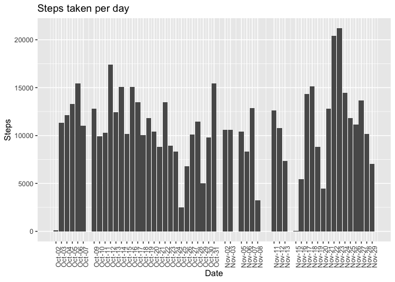
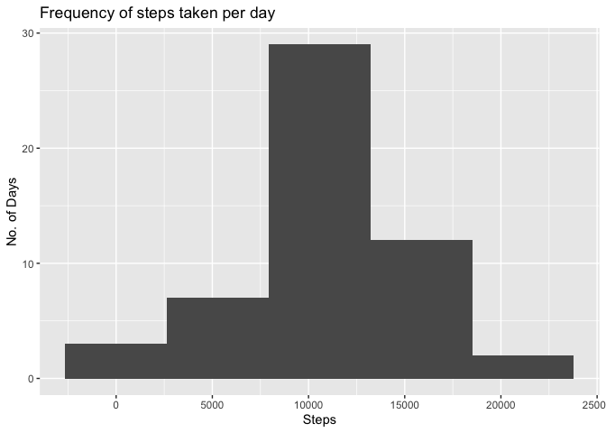
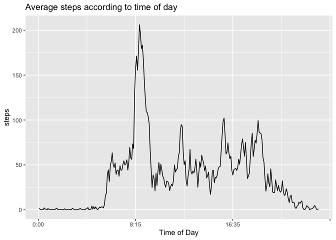
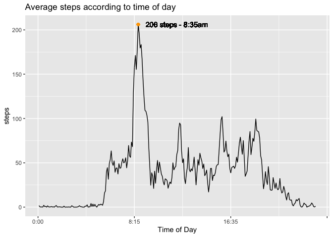
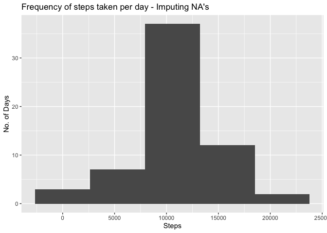
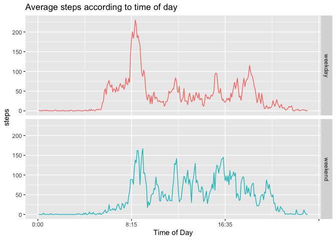

# Loading and preprocessing the data

Load package libraries and dowload data


```r
#load package libraries
library(dplyr)
```

```
## 
## Attaching package: 'dplyr'
```

```
## The following objects are masked from 'package:stats':
## 
##     filter, lag
```

```
## The following objects are masked from 'package:base':
## 
##     intersect, setdiff, setequal, union
```

```r
library(ggplot2)

#create data folder, download data & unzip file 
if(!file.exists("./DataSets")){dir.create("./DataSets")}
URL <- "https://d396qusza40orc.cloudfront.net/repdata%2Fdata%2Factivity.zip"
if(!file.exists("./DataSets/repdata-data-activity.zip")){
        download.file(URL,destfile="./DataSets/repdata-data-activity.zip", method="curl")
        #Unzip Files
        unzip(zipfile="./DataSets/repdata-data-activity.zip",exdir="./DataSets")
}

#View list of the file(s)
DataFiles <-list.files("./DataSets", recursive=TRUE)
DataFiles
```

```
## [1] "activity.csv"              "repdata-data-activity.zip"
```

**1. Load the data**


```r
data <- tbl_df(read.csv("./DataSets/activity.csv"))
data
```

```
## # A tibble: 17,568 x 3
##    steps date       interval
##    <int> <fct>         <int>
##  1    NA 2012-10-01        0
##  2    NA 2012-10-01        5
##  3    NA 2012-10-01       10
##  4    NA 2012-10-01       15
##  5    NA 2012-10-01       20
##  6    NA 2012-10-01       25
##  7    NA 2012-10-01       30
##  8    NA 2012-10-01       35
##  9    NA 2012-10-01       40
## 10    NA 2012-10-01       45
## # … with 17,558 more rows
```

**2. Process/transform the data (if necessary) into a format suitable for your analysis**

Turn date column into date variables and interval column into time
and create a new column with date and time in POSIXct format


```r
data$date <- as.Date(as.character(data$date))
data$interval <- substr(as.POSIXct(sprintf("%04.0f", data$interval), format='%H%M'), 12, 16)
data$date.time <- as.POSIXlt(paste(data$date, data$interval))
```


# What is mean total number of steps taken per day?

**1. Calculate the total number of steps taken per day**

To do this, aggregate sum of steps taken by date, then we can viusalize this 
by plotting on bar plot


```r
StepsbyDay <- aggregate(steps ~ date, data, sum)

plot1 <- ggplot(StepsbyDay, aes(date, steps))
plot1 <- plot1 + geom_col() +
        xlab("Date") +
        ylab("Steps") +
        ggtitle("Steps taken per day") +
        theme(axis.text.x = element_text(angle = 90))+
        scale_x_date(breaks = as.Date(c(StepsbyDay$date)), date_labels = "%b-%d")
plot1
```

<!-- -->

Or simply view on the table with aggregated values


```r
StepsbyDay$date <- format(StepsbyDay$date, "%b-%d")
StepsbyDay
```

```
##      date steps
## 1  Oct-02   126
## 2  Oct-03 11352
## 3  Oct-04 12116
## 4  Oct-05 13294
## 5  Oct-06 15420
## 6  Oct-07 11015
## 7  Oct-09 12811
## 8  Oct-10  9900
## 9  Oct-11 10304
## 10 Oct-12 17382
## 11 Oct-13 12426
## 12 Oct-14 15098
## 13 Oct-15 10139
## 14 Oct-16 15084
## 15 Oct-17 13452
## 16 Oct-18 10056
## 17 Oct-19 11829
## 18 Oct-20 10395
## 19 Oct-21  8821
## 20 Oct-22 13460
## 21 Oct-23  8918
## 22 Oct-24  8355
## 23 Oct-25  2492
## 24 Oct-26  6778
## 25 Oct-27 10119
## 26 Oct-28 11458
## 27 Oct-29  5018
## 28 Oct-30  9819
## 29 Oct-31 15414
## 30 Nov-02 10600
## 31 Nov-03 10571
## 32 Nov-05 10439
## 33 Nov-06  8334
## 34 Nov-07 12883
## 35 Nov-08  3219
## 36 Nov-11 12608
## 37 Nov-12 10765
## 38 Nov-13  7336
## 39 Nov-15    41
## 40 Nov-16  5441
## 41 Nov-17 14339
## 42 Nov-18 15110
## 43 Nov-19  8841
## 44 Nov-20  4472
## 45 Nov-21 12787
## 46 Nov-22 20427
## 47 Nov-23 21194
## 48 Nov-24 14478
## 49 Nov-25 11834
## 50 Nov-26 11162
## 51 Nov-27 13646
## 52 Nov-28 10183
## 53 Nov-29  7047
```

**2.Make a histogram of steps taken per day**


```r
plot2 <- qplot(steps, data = StepsbyDay, bins = 5)
plot2 <- plot2 +
        xlab("Steps") +
        ylab("No. of Days") +
        ggtitle("Frequency of steps taken per day")
plot2
```

<!-- -->

**3.Calculate and report the mean and median of the total number of steps taken per day**


```r
summary(StepsbyDay$steps)
```

```
##    Min. 1st Qu.  Median    Mean 3rd Qu.    Max. 
##      41    8841   10765   10766   13294   21194
```

We see that the mean mean is 10,766 steps per day and the median is 10,765 steps per day


# What is the average daily activity pattern?

**1. Make a time series plot of the 5-minute interval (x-axis) and the average number of steps taken, averaged across all days (y-axis)**

Aggregate by time interval and add a column to identify numericaly each timestamp (will use for x-axis)


```r
StepsbyTimeInterval <- aggregate(steps ~ interval, data, mean)
StepsbyTimeInterval$id <- c(1:288)
```

Plot time series


```r
plot3 <- ggplot(StepsbyTimeInterval, aes(id, steps))
plot3 <- plot3 + geom_line() +
        scale_x_continuous(labels = c("0:00", "8:15", "16:35", "")) +
        xlab("Time of Day") +
        ylab("steps") +
        ggtitle("Average steps according to time of day")
plot3
```

<!-- -->

**2. Which 5-minute interval, on average across all the days in the dataset, contains the maximum number of steps?**

Get max by subsetting the table we used for plotting (table with the aggregated means of intervals)


```r
maxinterval <- subset(StepsbyTimeInterval, StepsbyTimeInterval$steps == max(StepsbyTimeInterval$steps))
maxinterval
```

```
##     interval    steps  id
## 104    08:35 206.1698 104
```

206 is the maximum average steps for one 5 minute interval, corresponding tothe 8:35am iterval

We can add this to our plot to verify visually


```r
plot3a <- plot3 + 
        geom_point(x = maxinterval$id, y = maxinterval$steps, color = "orange") +
        geom_text(x = maxinterval$id + 40, y = maxinterval$steps, 
                  label = "206 steps - 8:35am")
plot3a 
```

<!-- -->


# Imputing missing values

**1.Calculate and report the total number of missing values in the## dataset (i.e. the total number of rows with NAs)**

Explore amount of NA values per column


```r
sum(is.na(data$steps))
```

```
## [1] 2304
```

```r
sum(is.na(data$date))
```

```
## [1] 0
```

```r
sum(is.na(data$interval))
```

```
## [1] 0
```
NA values are only present in the steps column, therefore there are 2,304 missing values.

**2. Devise a strategy for filling in all of the missing values in the dataset** 

Create a new data set, add column with mean number of steps corresponding to that
time interval. We get these values by merging with our table with the aggregated means of intervals. This will allow us to replace NA values with values on the new column.


```r
data2 <- data
data2 <- merge(data2, StepsbyTimeInterval, by = "interval")
data2$date.time <- as.POSIXct(data2$date.time)
data2 <- tbl_df(data2)
data2 <- arrange(data2, date.time)
names(data2) <- c("interval", "steps", "date", "date.time", "interval.mean", "interval.id")
```

**3. Create a new dataset that is equal to the original dataset but with the missing data filled in**

Replace NA values and subset dataframe to retain original columns


```r
data2$steps <- ifelse(is.na(data2$steps), data2$interval.mean, data2$steps)
data2 <- data2[,c("steps","date", "interval", "date.time")]
data2
```

```
## # A tibble: 17,568 x 4
##     steps date       interval date.time          
##     <dbl> <date>     <chr>    <dttm>             
##  1 1.72   2012-10-01 00:00    2012-10-01 00:00:00
##  2 0.340  2012-10-01 00:05    2012-10-01 00:05:00
##  3 0.132  2012-10-01 00:10    2012-10-01 00:10:00
##  4 0.151  2012-10-01 00:15    2012-10-01 00:15:00
##  5 0.0755 2012-10-01 00:20    2012-10-01 00:20:00
##  6 2.09   2012-10-01 00:25    2012-10-01 00:25:00
##  7 0.528  2012-10-01 00:30    2012-10-01 00:30:00
##  8 0.868  2012-10-01 00:35    2012-10-01 00:35:00
##  9 0      2012-10-01 00:40    2012-10-01 00:40:00
## 10 1.47   2012-10-01 00:45    2012-10-01 00:45:00
## # … with 17,558 more rows
```

**4.Make a histogram of the total number of steps taken each day and Calculate and report the mean and median total number of steps taken per day.**

We ggregate sum of steps taken by date

```r
StepsbyDay2 <- aggregate(steps ~ date, data2, sum)
```

And viusalize this by plotting histogram


```r
plot4 <- qplot(steps, data = StepsbyDay2, bins = 5)
plot4 <- plot4 +
        xlab("Steps") +
        ylab("No. of Days") +
        ggtitle("Frequency of steps taken per day - Imputing NA's")
plot4
```

<!-- -->

and compare it with our initial histogram


```r
plot2
```

<!-- -->

And we can compare means and median


```r
summary(StepsbyDay$steps)
```

```
##    Min. 1st Qu.  Median    Mean 3rd Qu.    Max. 
##      41    8841   10765   10766   13294   21194
```

```r
summary(StepsbyDay2$steps)
```

```
##    Min. 1st Qu.  Median    Mean 3rd Qu.    Max. 
##      41    9819   10766   10766   12811   21194
```

**What is the impact of imputing missing data on the estimates of the total daily number of steps? Do these values differ from the estimates from the first part of the assignment?**

The impact of imputing the data was barely noticeable on mean and median, however
we did notice a change in frequencies, with about 8 more days registering in the
10k steps per day range. 

 
# Are there differences in activity patterns between weekdays and weekends

**1. Create a new factor variable in the dataset with two levels – “weekday” and “weekend” indicating whether a given date is a weekday or weekend day.**


```r
data2$weekday <- weekdays(data2$date.time)
data2$weekday <- ifelse(data2$weekday == "Saturday" | data2$weekday == 
                                "Sunday", "weekend", "weekday")
```

**2. Make a panel plot containing a time series plot (i.e. type = "l" of the 5-minute interval (x-axis) and the average number of steps taken, averaged across all weekday days or weekend days (y-axis)**

As with previous time series plot, aggregate by interval and create numeric id column to use on the x axis


```r
weekdays <- 
        aggregate(steps ~ interval, subset(data2, data2$weekday == "weekday"), mean)
weekdays$id <- c(1:288)
weekdays$type <- "weekday"
weekends <-
        aggregate(steps ~ interval, subset(data2, data2$weekday == "weekend"), mean)
weekends$id <- c(1:288)
weekends$type <- "weekend"
StepsbyTimeInterval2 <- rbind(weekdays, weekends)
```

Then plot the time series


```r
plot5 <- ggplot(StepsbyTimeInterval2, aes(id, steps, color = type))
plot5 <- plot5 + geom_line() +
        scale_x_continuous(labels = c("0:00", "8:15", "16:35", "")) +
        xlab("Time of Day") +
        ylab("steps") +
        ggtitle("Average steps according to time of day") +
        facet_grid(type~.) + 
        theme(legend.position = "none")
plot5
```

<!-- -->

We see there are differences in activity bewteen weekdays and weekends. There is more early morning activity during weekdays, and more early afternoon and late night activity during weekends.
